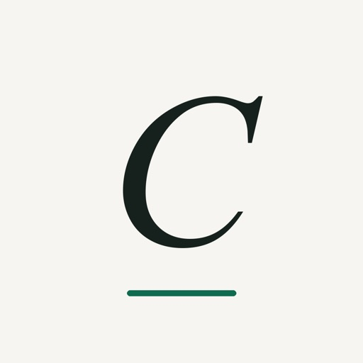

# Lianwen Wu

Independent software maker in Shanghai. I build focused iOS apps and open-source tools.

[Website](https://lianwenwu.me/) · [Email](mailto:wul55267@gmail.com)

## Apps

<table>
  <tr>
    <td width="50%" valign="top">
      
      <h3>Unscript · 脱稿</h3>
      
同一段真实英语对话练四遍，提示逐步减少，直到真正脱稿说出来。

      
562 段对话 · 端上语音识别 · 无需账号

      <a href="https://hintlib.com/">官网</a> · <a href="https://apps.apple.com/cn/app/unscript-%E8%84%B1%E7%A8%BF-%E8%8B%B1%E8%AF%AD%E5%8F%A3%E8%AF%AD%E7%BB%83%E4%B9%A0/id6803985536">App Store</a>
    </td>
    <td width="50%" valign="top">
      
      <h3>Cenno</h3>
      
快速记录支出、预算与净资产。数据留在设备与自己的 iCloud，不上传服务器。

      
三秒记一笔 · 无广告 · 导出永久免费

      <a href="https://cenno.app/">官网</a> · <a href="https://apps.apple.com/cn/app/%E8%B4%A6%E6%9C%AC%E6%9C%AC-cenno-%E6%97%A0%E5%B9%BF%E5%91%8A%E7%A6%BB%E7%BA%BF%E9%9A%90%E7%A7%81%E8%AE%B0%E8%B4%A6/id6760214754">App Store</a>
    </td>
  </tr>
</table>

## Open source

- [**reactuse**](https://github.com/childrentime/reactuse) — 115+ production-ready React Hooks
- [**pareto**](https://github.com/childrentime/pareto) — streaming-first React framework
- [**gotsx**](https://github.com/childrentime/gotsx) — compile TSX server components to Go

I also contributed to [Immer](https://github.com/immerjs/immer), [React](https://github.com/facebook/react), [xterm.js](https://github.com/xtermjs/xterm.js), [Rspress](https://github.com/web-infra-dev/rspress), and other open-source projects.
